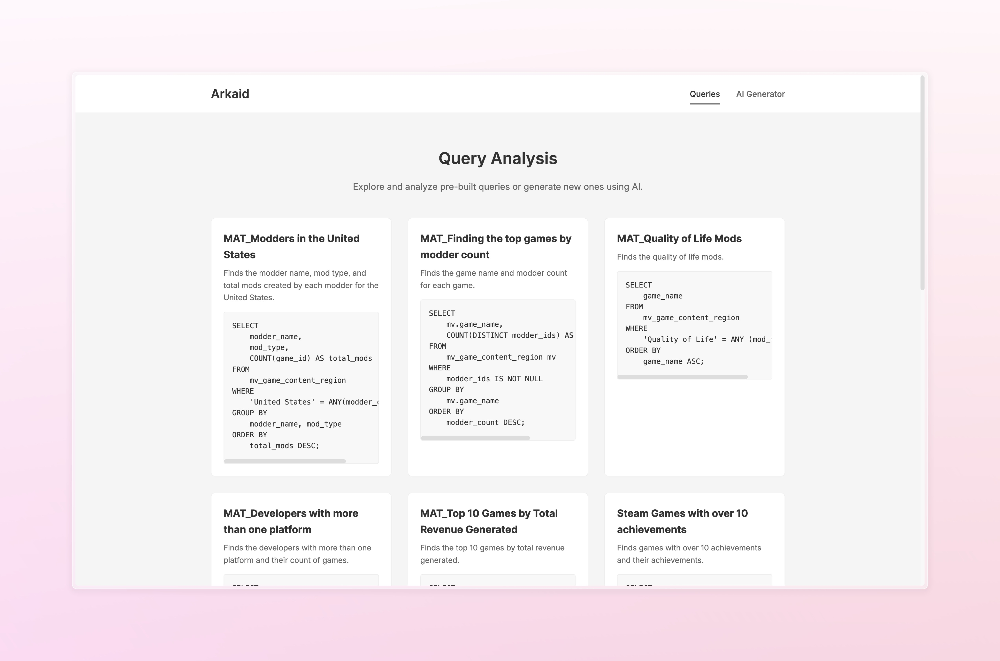

# Arkaid - Game Performance Analytics Platform



Arkaid is a comprehensive game performance analytics platform developed as part of the Information Integration Architecture course (IIA - CSE656). It employs a data warehouse approach to analyze and integrate gaming data from multiple sources, providing insights through an AI-powered interface.

## Project Overview

Arkaid combines data from multiple gaming platforms and sources, utilizing ETL processes and materialized views to create a unified analytical platform. The project features natural language query capabilities powered by TogetherAI, enabling users to easily access and analyze gaming performance data.

## Key Features

- **Multi-Source Data Integration**: Combines data from Steam and Epic Games platforms
- **Advanced Analytics**: Game performance metrics, player behavior analysis, and content creator insights
- **Natural Language Queries**: AI-powered conversion of natural language to SQL queries
- **Real-time Data Processing**: ETL pipelines for continuous data updates
- **Interactive Interface**: Web-based interface for data exploration and analysis

## Architecture

The project is organized into three main modules:

### 1. Data Generation
Located in `/Data_Generation`
- Generates and manages gaming-related datasets
- Creates realistic test data for development and testing
- Handles data for games, players, developers, publishers, and content creators
- [More details](Data_Generation/README.md)

### 2. ETL (Extract, Transform, Load)
Located in `/ETL`
- Manages data flow between different databases
- Creates and maintains materialized views
- Handles schema matching and data transformation
- Ensures data consistency and integrity
- [More details](ETL/README.md)

### 3. Interface
Located in `/Interface`
- Provides web-based user interface
- Integrates TogetherAI for natural language processing
- Executes and visualizes query results
- Manages database connections and query optimization
- [More details](Interface/README.md)

## Database Structure

The project utilizes three PostgreSQL databases:
1. **DB1**: Epic Games data source
2. **DB2**: Steam data source
3. **DB3**: Centralized warehouse with materialized views

## Technologies Used

- **Backend**: Python, PostgreSQL
- **ETL**: Custom Python ETL framework
- **Frontend**: Flask, HTML/CSS
- **AI Integration**: TogetherAI API
- **Data Processing**: pandas, numpy
- **Database**: psycopg2, SQLAlchemy

## Setup

1. Clone the repository:
```bash
git clone https://github.com/lakshaybhushan/Arkaid-IIA.git
cd Arkaid-IIA
```

2. Set up each module:
```bash
# Set up Data Generation
cd Data_Generation
pip install -r requirements.txt

# Set up ETL
cd ../ETL
cp .env.example .env
# Edit .env with your database credentials

# Set up Interface
cd ../Interface
cp .env.example .env
# Edit .env with your database and TogetherAI API credentials
```

3. Configure databases:
```bash
cd Interface
python db_config_generator.py
python connection_tester.py
```

4. Start the application:
```bash
# In the Interface directory
python app.py
```

## Usage

1. **Data Generation**:
   - Generate test data using the scripts in the Data_Generation module
   - Update and maintain data sources as needed

2. **ETL Processes**:
   - Run ETL scripts to process and transform data
   - Manage materialized views for optimized queries

3. **Interface**:
   - Access the web interface at `http://localhost:4321`
   - Use natural language to query the database
   - Explore predefined queries and visualizations


## Contributors
- [Lakshay Bhushan](https://github.com/lakshaybhushan)
- [Daksh Sammi](https://github.com/dakshsammi)
- [Sameer Budhiraja](https://github.com/Sameer-Budhiraja)